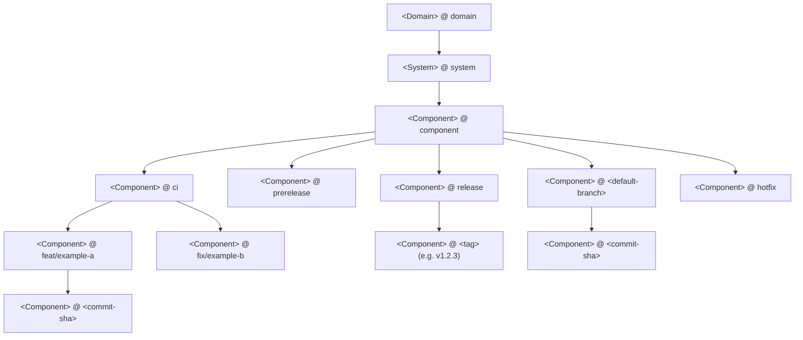
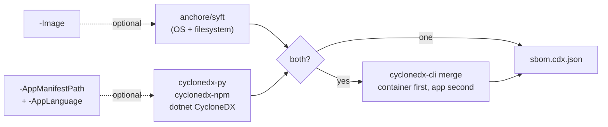
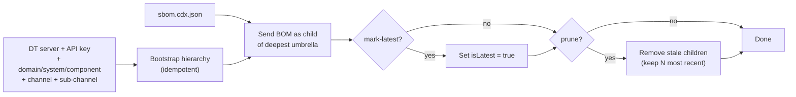

# pipeline-tools

Reusable CI/CD pipeline templates and PowerShell scripts. Targets GitHub Actions and Azure DevOps Pipelines, sharing PowerShell logic between the two.

> **This repository is public.** Read [`AGENTS.md`](AGENTS.md) before contributing - never commit hostnames, IPs, API keys, personal names, or other identifiable information.

## Layout

```
pipeline/
  ado/templates/
    step/
      sbom/build-cyclonedx-sbom.yaml             # Generate a CycloneDX BOM (container / app / merged)
      sbom/cyclonedx-dotnet.yaml                 # Backward-compat .NET wrapper (delegates to build-cyclonedx-sbom)
      sbom/upload-sbom-to-dependency-track.yaml  # Composite step: build + DT hierarchy upload
      dt/initialize-hierarchy.yaml               # Bootstrap a Backstage hierarchy in DT
      dt/send-bom.yaml                           # Upload a BOM to DT (returns masked uploadToken)
      dt/set-project-latest.yaml                 # Mark project as isLatest = true
      dt/remove-stale-children.yaml              # Delete old children, keep N most recent
    job/
      upload-sbom-to-dependency-track.yaml       # .NET-flavoured job (checkout + UseDotNet@2 + build + upload)
  github/
    step/
      build-cyclonedx-sbom/                      # Generate a CycloneDX BOM (container / app / merged)
      cyclonedx-sbom-dotnet/                     # Backward-compat .NET wrapper
      dt-bootstrap-hierarchy/                    # Bootstrap a Backstage hierarchy in DT
      dt-upload-bom/                             # Upload a BOM to DT
      dt-mark-latest/                            # Mark project as isLatest = true
      dt-prune-stale-children/                   # Delete old children
      dt-wait-bom-processing/                    # Poll until DT finishes processing the upload
    job/
      upload-sbom-to-dependency-track/           # Orchestrating composite action (build + upload)
scripts/
  sbom/
    Build-CycloneDxSbom.ps1                      # Single source of truth: Syft + app scanner + merge
    New-CycloneDxSbom.ps1                        # Backward-compat .NET wrapper
  dependency-track/
    Initialize-DTHierarchy.ps1                   # Bootstrap the four-level Backstage hierarchy
    Send-DTBom.ps1                               # Upload a BOM
    Set-DTProjectLatest.ps1                      # Mark isLatest
    Remove-DTStaleChildren.ps1                   # Prune children
    Wait-DTBomProcessing.ps1                     # Poll for processing
.github/
  workflows/                                     # Repo's own CI (lint, validate)
```

## v2 migration (breaking)

v2 enforces the four-level Backstage hierarchy and consolidates SBOM generation behind a single PowerShell script. Tags `v2.x.x` and onward will fail builds that depend on v1 behaviour. v1 consumers stay on v1 tags until they migrate.

| Area | v1 | v2 |
|---|---|---|
| GitHub composite | `parent-name` + `parent-version` (legacy flat parent) | Removed. `domain`/`system`/`component`/`channel` are required. |
| GitHub composite | `bom-path` required, generation external | `bom-path` optional. Action generates from `image` and/or `app-language` when omitted. |
| ADO `initialize-hierarchy.yaml` | `channel` optional (defaulted to `release`) | `channel` required. |
| ADO `Initialize-DTHierarchy.ps1` | `-Channel` optional | `-Channel` required. |
| SBOM generation | `New-CycloneDxSbom.ps1` (.NET only) | `Build-CycloneDxSbom.ps1` (container / Python / Node / .NET / merged). `New-CycloneDxSbom.ps1` kept as soft-deprecated wrapper. |
| Hierarchy depth | Four levels (domain/system/component/channel) | Optional fifth level (sub-channel) for grouping non-default-branch CI builds under a shared `ci` umbrella. |

The legacy flat-project flow (no domain/system/component) is no longer supported. Single-pane-of-glass licence and vulnerability visibility relies on a consistent Backstage layout across every consumer.

## How it works

### Hierarchy

Per-build SBOM uploads land as the leaf of a Backstage hierarchy. Bootstrap is idempotent: existing umbrella nodes are PATCHed back into shape, missing ones are PUT.



The `ci` channel exists only as a parent for sub-channels; SBOMs are never uploaded directly to `<Component>@ci`. Trunk-based repos typically use `release` + `<default-branch>` + `ci/<branch>`; gitflow repos add `prerelease` + `hotfix/<hotfix-id>`.

**Collection-logic note.** Each umbrella has a DT `collectionLogic` that controls how vulnerability metrics from below roll up. The defaults the bootstrap script applies:

| Umbrella | Collection logic | Why |
|---|---|---|
| `<Domain>@domain` | `AGGREGATE_DIRECT_CHILDREN` | Sum every system that lives under the domain. |
| `<System>@system` | `AGGREGATE_DIRECT_CHILDREN` | Sum every component that lives under the system. |
| `<Component>@component` | `AGGREGATE_DIRECT_CHILDREN` | Sum every channel under the component. `AGGREGATE_LATEST_VERSION_CHILDREN` would be ideal here (pick the canonical channel) but DT's `isLatest` flag is keyed by project name, and umbrellas share the project name with per-build children, so the latest-version logic collapses to zero at the component view. Summing direct children is the workable alternative; the only downside is overcounting when the same SHA exists in multiple channels at the same time, which is rare. |
| `<Component>@<channel>` | `AGGREGATE_LATEST_VERSION_CHILDREN` | Per-channel view should reflect "the current production build", which is the child SHA marked `isLatest=true` at upload time. |
| `<Component>@<sub-channel>` | `AGGREGATE_LATEST_VERSION_CHILDREN` | Same reasoning, scoped to a single branch under `ci`. |

Override any of these via the `*-collection-logic` parameters on the bootstrap step / GitHub action if you need different semantics; the script is idempotent and will PATCH existing umbrellas back into shape on the next run.

### Build flow

`Build-CycloneDxSbom.ps1` orchestrates one or both scanners and merges their output.



Merge order matters: the container BOM goes in first and the application BOM goes in second. When Dependency-Track ingests the merged file and dedupes by purl, the later entry's metadata wins, so any package present in both scans inherits the lockfile-sourced licence and direct-vs-transitive flag from the language tool while keeping OS coverage from Syft.

Language-specific notes:

| `-AppLanguage` | Reads | Scanner image |
|---|---|---|
| `python` | `uv.lock`, `poetry.lock`, `Pipfile.lock`, or `requirements.txt` in the manifest dir (preference order) | `python:3.12-slim` + `cyclonedx-bom` (and `uv` when needed) |
| `node` | `package.json` + lockfile in the manifest dir (single-lockfile monorepos with workspaces are supported by pointing at the root) | `node:20-alpine` + `@cyclonedx/cyclonedx-npm` |
| `dotnet` | `.sln`, `.slnx`, or `.csproj` (the manifest path is the file, not a directory) | Local `dotnet` SDK (Docker for .NET is awkward because NuGet feed config has to be mounted in) |

### Upload flow



The "deepest umbrella" is `<Component>@<sub-channel>` when sub-channel is set, otherwise `<Component>@<channel>`. Set `mark-latest` to `true` for canonical release uploads only; for CI uploads, leave it `false`. `prune-stale-children` requires `PORTFOLIO_MANAGEMENT` because it deletes projects.

PR builds skip the bootstrap and upload steps by default. The BOM still publishes as a workflow / pipeline artifact so reviewers can inspect it.

## GitHub Actions example

Container scan only (e.g. a deployable binary baked into an image):

```yaml
jobs:
  sbom:
    runs-on: ubuntu-latest
    steps:
      - uses: actions/checkout@v5

      - uses: hoobio/pipeline-tools/pipeline/github/job/upload-sbom-to-dependency-track@v2.0.0
        with:
          image:           ghcr.io/${{ github.repository }}:${{ github.sha }}
          server-url:      ${{ secrets.DT_SERVER_URL }}
          api-key:         ${{ secrets.DT_API_KEY }}
          domain:          my-domain
          system:          my-system
          component:       ${{ github.event.repository.name }}
          channel:         release
          project-version: ${{ github.ref_name }}
          mark-latest:     'true'
```

Container + Python merge with branch-based channel routing:

```yaml
jobs:
  sbom:
    runs-on: ubuntu-latest
    steps:
      - uses: actions/checkout@v5

      - id: route
        shell: bash
        run: |
          BRANCH="${GITHUB_REF#refs/heads/}"
          BRANCH="${BRANCH#refs/tags/}"
          if [[ "$GITHUB_REF" == refs/tags/* ]]; then
            CHANNEL=release; SUBCHANNEL=""; MARK=true; PRUNE=false
          elif [ "$BRANCH" = "${{ github.event.repository.default_branch }}" ]; then
            CHANNEL="$BRANCH"; SUBCHANNEL=""; MARK=false; PRUNE=true
          else
            CHANNEL=ci; SUBCHANNEL="$BRANCH"; MARK=false; PRUNE=true
          fi
          echo "channel=$CHANNEL" >> "$GITHUB_OUTPUT"
          echo "sub_channel=$SUBCHANNEL" >> "$GITHUB_OUTPUT"
          echo "mark=$MARK" >> "$GITHUB_OUTPUT"
          echo "prune=$PRUNE" >> "$GITHUB_OUTPUT"

      - uses: hoobio/pipeline-tools/pipeline/github/job/upload-sbom-to-dependency-track@v2.0.0
        with:
          image:                ghcr.io/${{ github.repository }}:${{ github.sha }}
          app-language:         python
          app-manifest-path:    .
          server-url:           ${{ secrets.DT_SERVER_URL }}
          api-key:              ${{ secrets.DT_API_KEY }}
          domain:               my-domain
          system:               my-system
          component:            ${{ github.event.repository.name }}
          channel:              ${{ steps.route.outputs.channel }}
          sub-channel:          ${{ steps.route.outputs.sub_channel }}
          project-version:      ${{ github.sha }}
          mark-latest:          ${{ steps.route.outputs.mark }}
          prune-stale-children: ${{ steps.route.outputs.prune }}
```

BYO BOM (pre-generated by a tool the action doesn't wrap):

```yaml
- name: Generate BOM
  run: ./tools/my-custom-sbom-generator.sh --out sbom.cdx.json

- uses: hoobio/pipeline-tools/pipeline/github/job/upload-sbom-to-dependency-track@v2.0.0
  with:
    bom-path:        sbom.cdx.json
    server-url:      ${{ secrets.DT_SERVER_URL }}
    api-key:         ${{ secrets.DT_API_KEY }}
    domain:          my-domain
    system:          my-system
    component:       ${{ github.event.repository.name }}
    channel:         release
    project-version: ${{ github.ref_name }}
```

For fine-grained control, compose your own job from the step actions under `pipeline/github/step/`. Each step is documented in its `action.yml`.

## Azure DevOps Pipelines example

Step-level composite (drops into an existing job - keeps the build/test/deploy flow on a single agent):

```yaml
resources:
  repositories:
    - repository: pipeline_tools
      type: github
      name: hoobio/pipeline-tools
      ref: refs/tags/v2.0.0
      endpoint: hoobio  # ADO GitHub service connection name

variables:
  - group: My Dependency Track  # provides DT_HOST and DT_API_KEY (secret)

stages:
  - stage: build
    jobs:
      - job: build
        pool:
          name: my-pool
        steps:
          - checkout: self
          - checkout: pipeline_tools
            path: s/pipeline_tools

          # ... build and push image ...

          - bash: |
              set -eu
              BRANCH="${BUILD_SOURCEBRANCH#refs/heads/}"
              BRANCH="${BRANCH#refs/tags/}"
              if [[ "$BUILD_SOURCEBRANCH" == refs/tags/* ]]; then
                CHANNEL=release; SUBCHANNEL=""; MARK=true;  PRUNE=false
              elif [ "$BRANCH" = "main" ]; then
                CHANNEL=main;    SUBCHANNEL=""; MARK=false; PRUNE=true
              else
                CHANNEL=ci;      SUBCHANNEL="$BRANCH"; MARK=false; PRUNE=true
              fi
              echo "##vso[task.setvariable variable=dtChannel]$CHANNEL"
              echo "##vso[task.setvariable variable=dtSubChannel]$SUBCHANNEL"
              echo "##vso[task.setvariable variable=dtMarkLatest]$MARK"
              echo "##vso[task.setvariable variable=dtPrune]$PRUNE"
            displayName: 'Resolve DT channel from branch'

          - template: pipeline/ado/templates/step/sbom/upload-sbom-to-dependency-track.yaml@pipeline_tools
            parameters:
              scriptsDir:         $(Build.SourcesDirectory)/pipeline_tools/scripts
              image:              registry.example.com/myapp:$(Build.SourceVersion)
              appLanguage:        python
              appManifestPath:    $(Build.SourcesDirectory)/$(Build.Repository.Name)
              dtServerUrl:        https://$(DT_HOST)
              dtApiKey:           $(DT_API_KEY)
              domain:             my-domain
              system:             my-system
              component:          myapp
              channel:            $(dtChannel)
              subChannel:         $(dtSubChannel)
              projectVersion:     $(Build.SourceVersion)
              markLatest:         $(dtMarkLatest)
              pruneStaleChildren: $(dtPrune)
```

Job-level template (its own checkout + UseDotNet@2 + build + upload; convenient when SBOM generation is the whole job):

```yaml
stages:
  - stage: sbom
    jobs:
      - template: pipeline/ado/templates/job/upload-sbom-to-dependency-track.yaml@pipeline_tools
        parameters:
          pool:           my-pool
          solutionPath:   $(Build.SourcesDirectory)/$(Build.Repository.Name)/MySolution.slnx
          dtServerUrl:    https://$(DT_HOST)
          dtApiKey:       $(DT_API_KEY)
          domain:         my-domain
          system:         my-system
          component:      my-component
          channel:        release
```

The job template currently scans .NET only; container/python/node consumers should use the step composite above.

For fine-grained control, the step templates under `pipeline/ado/templates/step/` are usable in isolation. Each declares its inputs explicitly and is documented inline.

## PowerShell scripts

The composite actions are thin shells over PowerShell scripts in `scripts/`. The scripts are independently usable from any PowerShell 7+ context.

| Script | Purpose |
|---|---|
| [`scripts/sbom/Build-CycloneDxSbom.ps1`](scripts/sbom/Build-CycloneDxSbom.ps1) | Single source of truth for BOM generation. Container scan via Syft, application scan via cyclonedx-py / cyclonedx-npm / dotnet CycloneDX, optional merge via cyclonedx-cli. |
| [`scripts/sbom/New-CycloneDxSbom.ps1`](scripts/sbom/New-CycloneDxSbom.ps1) | Soft-deprecated v1 wrapper. Delegates to `Build-CycloneDxSbom.ps1` with `-AppLanguage dotnet`. |
| [`scripts/dependency-track/Initialize-DTHierarchy.ps1`](scripts/dependency-track/Initialize-DTHierarchy.ps1) | Bootstrap the Backstage hierarchy (domain/system/component/channel and optional sub-channel). |
| [`scripts/dependency-track/Send-DTBom.ps1`](scripts/dependency-track/Send-DTBom.ps1) | Upload a CycloneDX BOM to DT. |
| [`scripts/dependency-track/Set-DTProjectLatest.ps1`](scripts/dependency-track/Set-DTProjectLatest.ps1) | Mark a project version as `isLatest = true`. |
| [`scripts/dependency-track/Remove-DTStaleChildren.ps1`](scripts/dependency-track/Remove-DTStaleChildren.ps1) | Prune old child projects under a parent. |
| [`scripts/dependency-track/Wait-DTBomProcessing.ps1`](scripts/dependency-track/Wait-DTBomProcessing.ps1) | Poll DT until a BOM upload finishes processing, or fail on timeout. |

Private (internal) helper:

| Script | Purpose |
|---|---|
| [`scripts/dependency-track/private/Invoke-DTRestMethod.ps1`](scripts/dependency-track/private/Invoke-DTRestMethod.ps1) | Internal HTTP helper used by the public DT scripts. Not for direct consumption. |

All public scripts use `[CmdletBinding()]` with typed, validated parameters. Run `Get-Help <script> -Full` for detailed usage.

## Why composite actions and not reusable workflows

GitHub Actions only allows reusable workflows under `.github/workflows/`. To keep all reusable building blocks in one organised tree under `pipeline/github/`, we use composite actions. They're consumed exactly the same way:

```yaml
- uses: hoobio/pipeline-tools/pipeline/github/job/upload-sbom-to-dependency-track@<tag>
  with:
    ...
```

Pin to a release tag (`@v2.0.0`) or commit SHA. Avoid `@main`.

## Permissions

The DT scripts assume the API key has at minimum `PROJECT_CREATION_UPLOAD`. The pruning script and the first run of the hierarchy bootstrap require `PORTFOLIO_MANAGEMENT` (the bootstrap PATCHes umbrellas back into shape when classifier or collection-logic drifts, and the prune deletes projects). Subsequent no-op bootstrap runs only need the lower-privilege key.

## Versioning and releases

This repo uses [release-please](https://github.com/googleapis/release-please) to drive Conventional-Commits-based releases. Pushing to `main` opens (or updates) a release PR with the next version and a `CHANGELOG.md` entry. Merging the release PR creates the tag and a GitHub Release.

- Pin consumers to a release tag (`@v2.0.0`, `@v2.1.0`, ...) or a commit SHA. Avoid `@main`.
- Tags matching `v*` are protected against deletion and force-update; release assets are immutable once published.
- Breaking changes use `feat!:` or `fix!:` and a `BREAKING CHANGE:` footer; release-please bumps the major version and writes the migration steps into the CHANGELOG. Consumers on dependabot get a separately-labelled major-version PR.

PR titles are validated against Conventional Commits by `.github/workflows/pr-title-check.yaml`. Allowed types: `feat`, `fix`, `perf`, `revert`, `docs`, `style`, `refactor`, `test`, `build`, `ci`, `chore`. Only `feat` / `fix` / `perf` / `revert` produce changelog entries that trigger a version bump.

## Contributing

1. Read [`AGENTS.md`](AGENTS.md) carefully.
2. PowerShell only for new scripts; no Bash, no Python.
3. Conventional Commits, no emoji, no AB# suffix.
4. Update both GitHub and ADO surfaces when changing a reusable building block; single-platform PRs for cross-platform features are rejected.
5. Manually review the diff before push - especially for hardcoded URLs, IPs, names.
